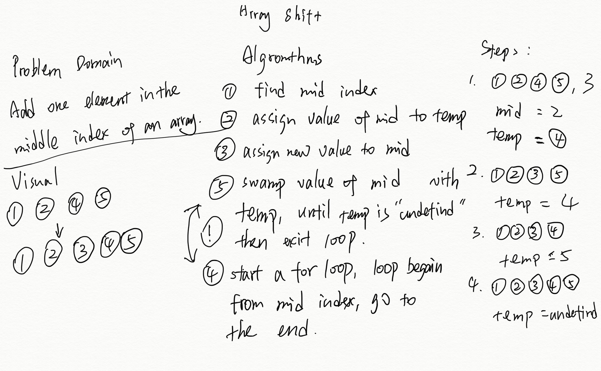

# Code Challenge

Insert and shift an array in middle at index

[Click here to see the code in JavaScript](../401-challenges/algorithms/arrayShift/array_shift.js)

[Click here to see the tester in JavaScript](../401-challenges/algorithms/arrayShift/array_shift.test.js)

[Click here to see the code in JAVA](../401-java-challenges/lib/src/main/java/challenges/ArrayShift.java)

[Click here to see the tester in JAVA](../401-java-challenges/lib/src/test/java/challenges/ArrayShiftTest.java)

## Feature Tasks

Write a function called insertShiftArray which takes in an array and the value to be added. Without utilizing any of the built-in methods available to your language, return an array with the new value added at the middle index.

## Example

|Input|Output|
|---|---|
|`[2,4,6,8], 5`|`[2,4,5,6,8]`|
|`[4,8,15,23,42], 16`|`[4,8,15,16,23,42]`|

## Approach & Efficiency

1. Big O is length of input array's Floor division to 2
2. use the for loop to loop array.length/2 times, starts from the mid index to the end.
3. at the mid index, update the element with new value
4. each time after that, push original one index after.
5. Return input array.

## Solution
<!-- Embedded whiteboard image -->

