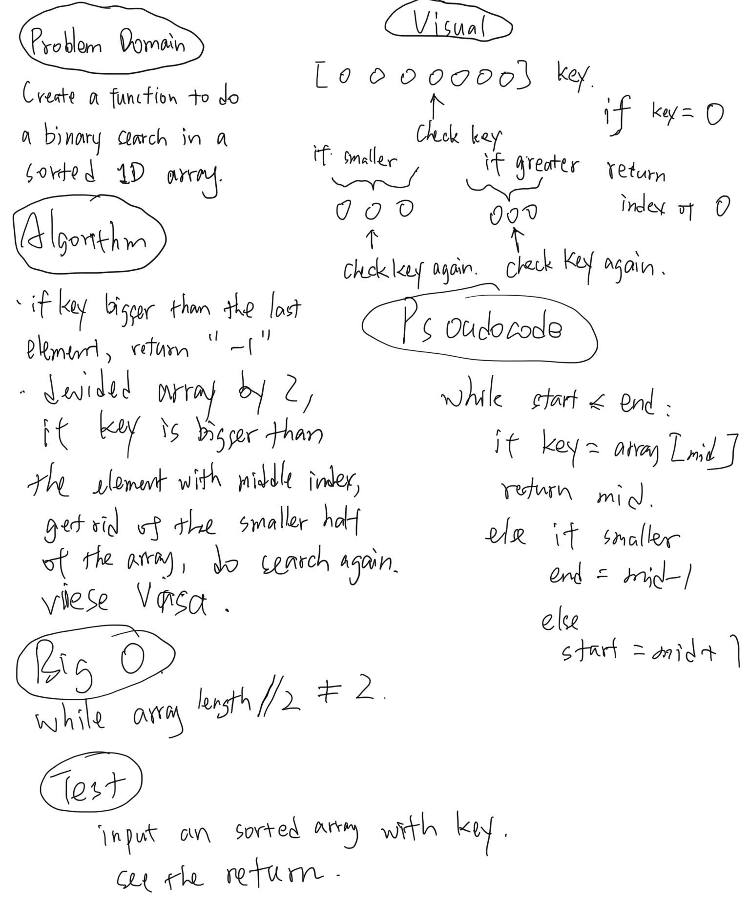

# Code Challenge

Binary search in a sorted 1D array

[Click here to see the code](array-binary-search.js)

[Click here to see the tester](array-binary-search.test.js)

## Feature Tasks

- Write a function called ```BinarySearch``` which takes in 2 parameters: a sorted array and the search key. Without utilizing any of the built-in methods available to your language, return the index of the array’s element that is equal to the search key, or -1 if the element does not exist.
- **NOTE**: The search algorithm used in your function should be a binary search.
  - Check the Resources section for details

## Example

|Input|Output|
|---|---|
|[4,8,15,16,23,42], 15|2|
|[11,22,33,44,55,66,77], 90|-1|


## Resources

[Wikipedia: Binary Search Algorithm](https://en.wikipedia.org/wiki/Binary_search_algorithm)

## Stretch Goal

Once you’ve achieved a working solution, benchmark with varying array sizes `(100, 10000, 100000 elements)`

## Approach & Efficiency

1. Big O is `O(log(n))`
2. compair the key with element that has the middle index first, if key is smaller than that element, get rid or the greater half of the array, do the search again; vice versa.
3. if match is found, return the index;
4. if not, return -1;

## Solution
<!-- Embedded whiteboard image -->

