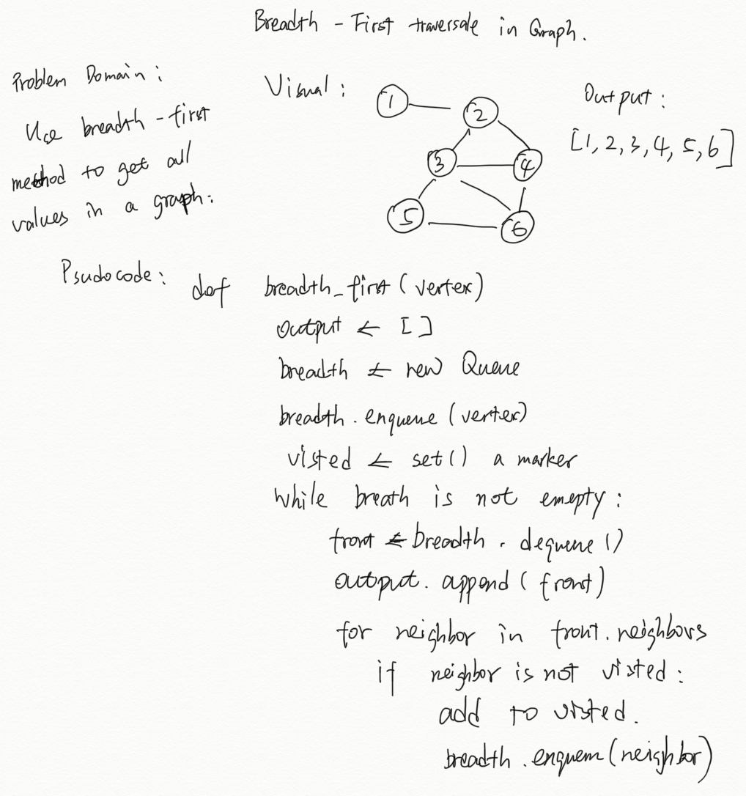

# Implement a breadth-first traversal on a graph

[Click here to see the code](./breadth-first.js)

[Click here to see the tester](./breadth-first.test.js)

## Feature Tasks

Extend your graph object with a breadth-first traversal method that accepts a starting node. Without utilizing any of the built-in methods available to your language, return a collection of nodes in the order they were visited. Display the collection.

## Structure and Testing

Utilize the Single-responsibility principle: any methods you write should be clean, reusable, abstract component parts to the whole challenge. You will be given feedback and marked down if you attempt to define a large, complex algorithm in one function definition.

Write at least three test assertions for each method that you define.

Ensure your tests are passing before you submit your solution.

## Example


Output:

```text
Pandora, Arendelle, Metroville, Monstroplolis, Narnia, Naboo
```

## Stretch Goal

Once you’ve achieved a working solution, define a new method that accepts two nodes as input and uses your traversal algorithm to determine if a path exists between the two nodes.

## Solution


