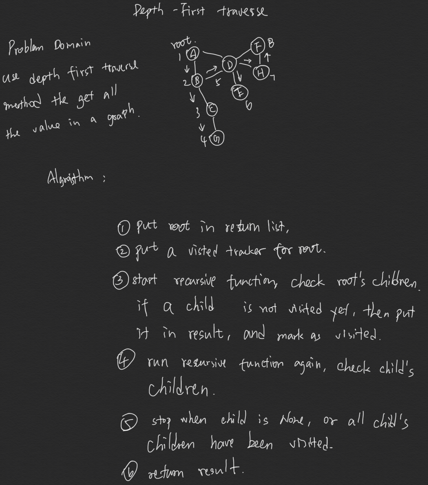

# Code Challenge

Conduct a depth first preorder traversal on a graph

[Click here to see the code](depth-first.js)

[Click here to see the tester](depth-first.test.js)

## Feature Tasks

Create a function that accepts an adjacency list as a graph, and conducts a depth first traversal. Without utilizing any of the built-in methods available to your language, return a collection of nodes in their pre-order depth-first traversal order.

## Example


Output: ```A, B, C, G, D, E, H, F```

## Approach & Efficiency

Big O time is O(n). Every time the recursive function is called, it put a value i the result list. The result list is as long as the number of vertices of this graph, so Big O is O(n).

## solution

