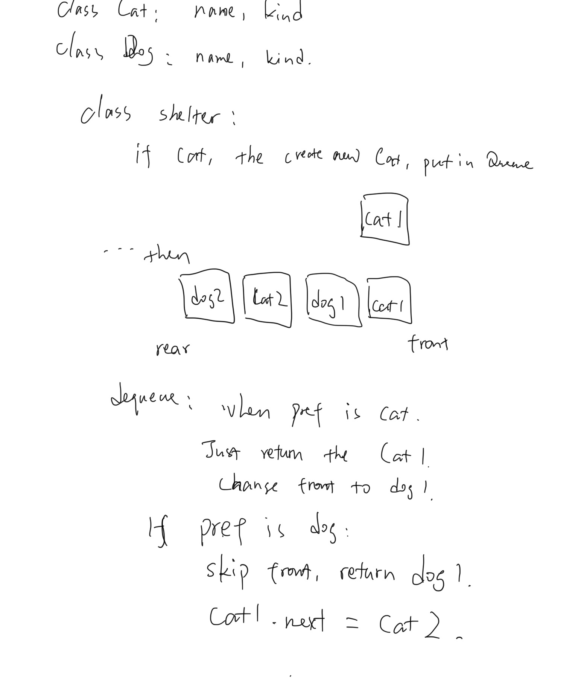

# First-in, First out Animal Shelter

[Click here to see the code.](./fifo-animal-shelter.js)
[Click here to see the tester code](./fifo-animal-shelter.test.js)

## Feature Tasks

- Create a class called AnimalShelter which holds only dogs and cats. The shelter operates using a first-in, first-out approach.
- Implement the following methods:
  - enqueue(animal): adds animal to the shelter. animal can be either a dog or a cat object.
  - dequeue(pref): returns either a dog or a cat. If pref is not "dog" or "cat" then return null.

## Big O

big O for enqueue is O(1)
big O for dequeue could be the number of animals in shelter in worst case, so O(n).

## solution

