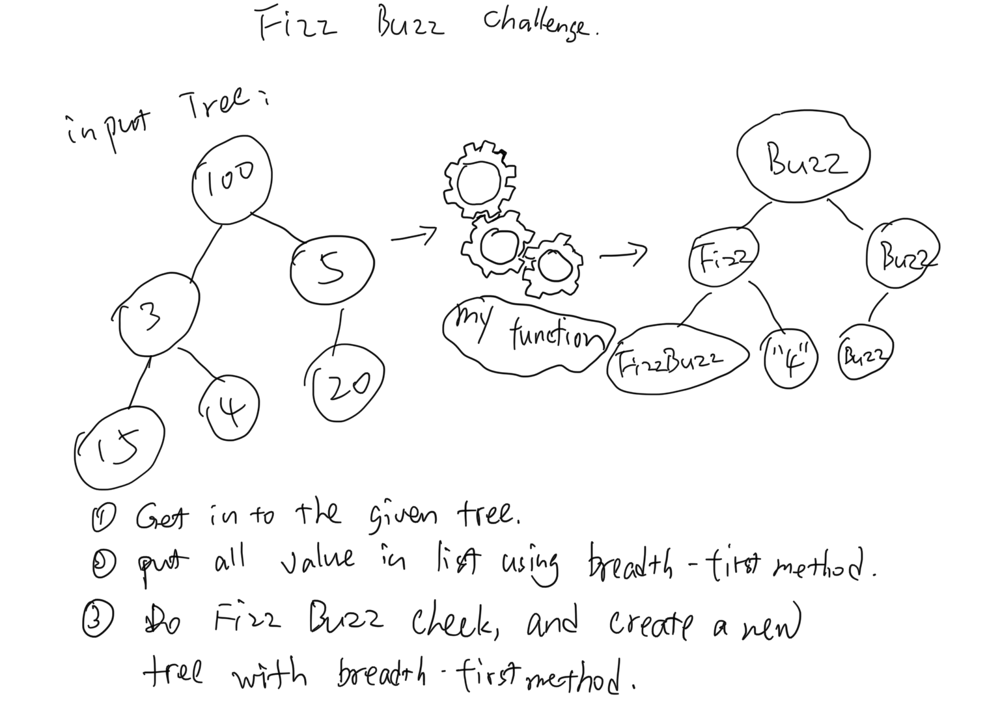

# Code Challenge

Conduct “FizzBuzz” on a tree while traversing through it. Change the values of each of the nodes dependent on the current node’s value

[click here to see the code](./fizz-buzz-tree.js)

[click here to see the tester](./fizz-buzz-tree.test.js)

## Feature Tasks

- Write a function called FizzBuzzTree which takes a tree as an argument.
- Without utilizing any of the built-in methods available to your language, determine whether or not the value of each node is divisible by 3, 5 or both. Create a new tree with the same structure as the original, but the values modified as follows:
  - If the value is divisible by 3, replace the value with “Fizz”
  - If the value is divisible by 5, replace the value with “Buzz”
  - If the value is divisible by 3 and 5, replace the value with “FizzBuzz”
  - If the value is not divisible by 3 or 5, simply turn the number into a String.

## Big O

the big o for this function:
step 1: using breadth first method to store all the values in a list, this big o time is O(n), Big o space is O(w).
step 2: using for loop to create a new bionary tree with modified fizz buzz info. Big O time is O(n), Big O space is O(w).

## solution

