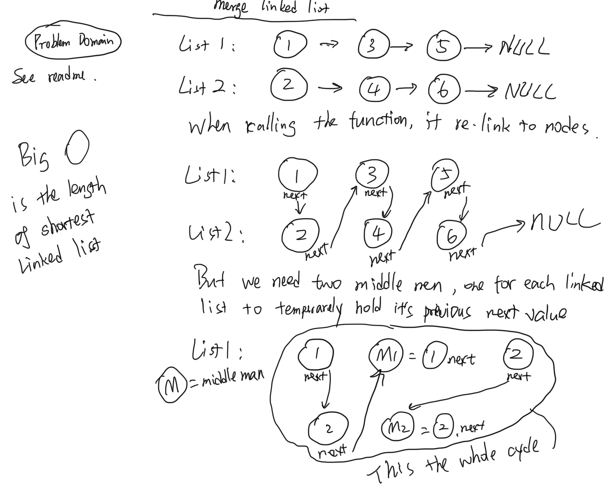

# Merge two linked lists.

[click here to see the code](ll-zip.js)

[click here to see the tester code](ll-zip.test.js)

## Feature Tasks

Write a function called **mergeLists** which takes two linked lists as arguments. Zip the two linked lists together into one so that the nodes alternate between the two lists and return a reference to the head of the zipped list. Try and keep additional space down to O(1). You have access to the Node class and all the properties on the Linked List class as well as the methods created in previous challenges.

## Example

### **mergeLists(list1, list2)**

|Arg list1|Arg list2|Output|
|--|--|--|
|`head -> [1] -> [3] -> [2] -> X`|`head -> [5] -> [9] -> [4] -> X`|`head -> [1] -> [5] -> [3] -> [9] -> [2] -> [4] -> X`|
|`head -> [1] -> [3] -> X`|`head -> [5] -> [9] -> [4] -> X` |`head -> [1] -> [5] -> [3] -> [9] -> [4] -> X`|
|`head -> [1] -> [3] -> [2] -> X`|`head -> [5] -> [9] -> X`|`head -> [1] -> [5] -> [3] -> [9] -> [2] -> X`|

## Structure

- The next node of List_1's head will be pointing to the head of List_2.
- The next node of List_2's head will be pointing to the origional next node of List_1's head.
- so on...

## Efficiency

Big O for this function is always same length to the shortest linked list.

## Solutions:

