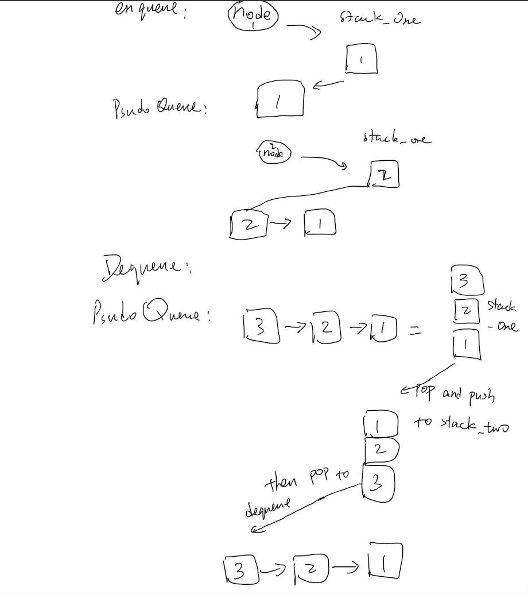

# Implement a Queue using two Stacks

[click here to see the code](./queue-with-stacks.js)

[click here to see the tester code](./queue-with-stacks.test.js)

## Feature Tasks

Create a brand new PseudoQueue class. Do not use an existing Queue. Instead, this PseudoQueue class will implement our standard queue interface (the two methods listed below), but will internally only utilize 2 Stack objects. Ensure that you create your class with the following methods:

- **enqueue(value)** which inserts value into the PseudoQueue, using a first-in, first-out approach.
- **dequeue()** which extracts a value from the PseudoQueue, using a first-in, first-out approach.
The Stack instances have only push, pop, and peek methods. You should use your own Stack implementation. Instantiate these Stack objects in your PseudoQueue constructor.

## Example

### **enqueue(value)**

|Input|Args|Output|
|--|--|--|
|[10]->[15]->[20]|5|[5]->[10]->[15]->[20]|
||5|[5]|

### **dequeue()**

|Input|Output|Internal State|
|--|--|--|
|[5]->[10]->[15]->[20]|20|[5]->[10]->[15])|
|[5]->[10]->[15]|15|[5]->[10]|

## Solution

