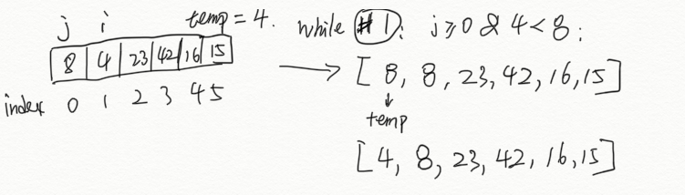
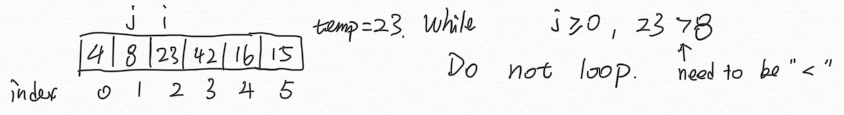
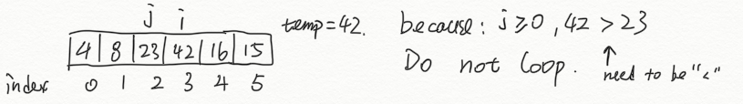
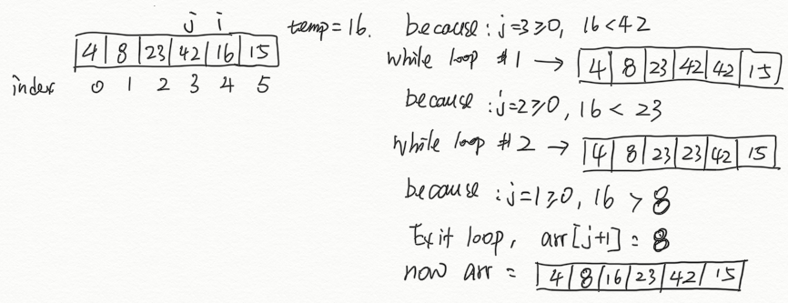
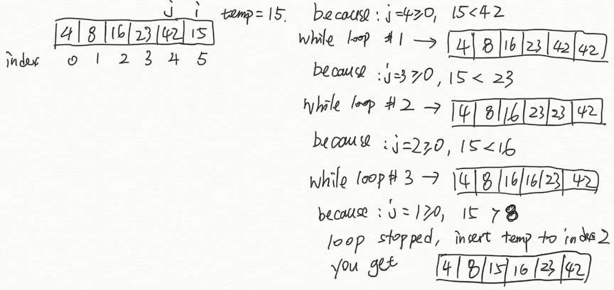

# Insertion Sort

Insertion sort is a sorting algorithm that:

1. Work from left to right
2. Examine each item and compare it to items on its left
3. Insert the item in the correct position in the array

[Click here to see the code](insertion_sort.js)

[Click here to see the tester](../all_sort.test.js)

## Pseudocode

```sudo
InsertionSort(int[] arr)

    FOR i = 1 to arr.length

      int j <-- i - 1
      int temp <-- arr[i]

      WHILE j >= 0 AND temp < arr[j]
        arr[j + 1] <-- arr[j]
        j <-- j - 1

      arr[j + 1] <-- temp
```

## Trace

```[8,4,23,42,16,15]```

### Pass 1:



In the first pass through of the insertion sort, we started with the 2nd number in the list. and evaluate if it is smaller than the 1st number. If it is, then swapte their places in the list.

### Pass 2:



In the 2nd pass through of the insertion sort, since the 3rd number is greater than the 2nd, we do not go into the while loop.

### Pass 3:



In the 3rd pass through of the insertion sort, since the 4th number is greater than the 3rd, we do not go into the while loop.

### Pass 4:



In the 4th pass through of the insertion sort, since the 5th number is smaller than the 4th, we go into the while loop and swamp the 5th and 4th number. Then check the 4th number with the 3rd number, since it is still smaller, we swamp again.

### Pass 5:



In the 5th pass through of the insertion sort, since the last number is smaller than the 5th, we go into the while loop and swamp the 6th and 5th number. Then check the 5th number with the 4th number, since it is still smaller, we swamp again, and again until we got a sorted list.

## Efficency

### Time: O(n^2)

The basic operation of this algorithm is comparison. For best case, if given a sorted list, then this will compair n-1 times. But for worst case scenario, it will compair n+(n-1)+(n-2)+...+ 3 +2, which is T(n)-1.

### Space: O(1)

No additional space is being created. This array is being sorted in place…keeping the space at constant O(1).
