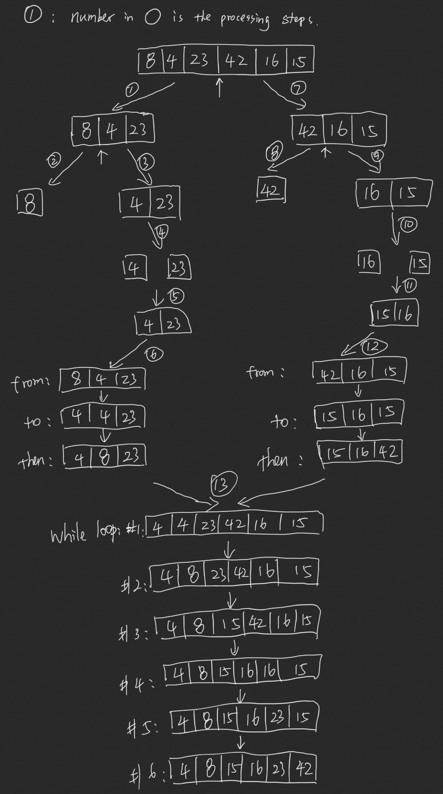

# Merge Sort

Merge sort is a sorting algorithm that:

1. split the array into two pieces from the middle
2. split the left part into two pieces again, until there's only one element in the array.
3. combine from pieces up in sorted arrangement.

## Pseudo Code

```pseudo
ALGORITHM Mergesort(arr)
    DECLARE n <-- arr.length

    if n > 1
      DECLARE mid <-- n/2
      DECLARE left <-- arr[0...mid]
      DECLARE right <-- arr[mid...n]
      // sort the left side
      Mergesort(left)
      // sort the right side
      Mergesort(right)
      // merge the sorted left and right sides together
      Merge(left, right, arr)

ALGORITHM Merge(left, right, arr)
    DECLARE i <-- 0
    DECLARE j <-- 0
    DECLARE k <-- 0

    while i < left.length && j < right.length
        if left[i] <= right[j]
            arr[k] <-- left[i]
            i <-- i + 1
        else
            arr[k] <-- right[j]
            j <-- j + 1

        k <-- k + 1

    if i = left.length
       set remaining entries in arr to remaining values in right
    else
       set remaining entries in arr to remaining values in left
```

## Trace

In our case, the sample array is ```[8,4,23,42,16,15]```



## Efficency

### Time: O(n*log(n))

The basic operation of this algorithm is recursion. It will happen n*log(n)times

### Space: O(n)

Memory space equal to the origional array is being created. This array is being sorted in place…keeping the space at constant O(n).