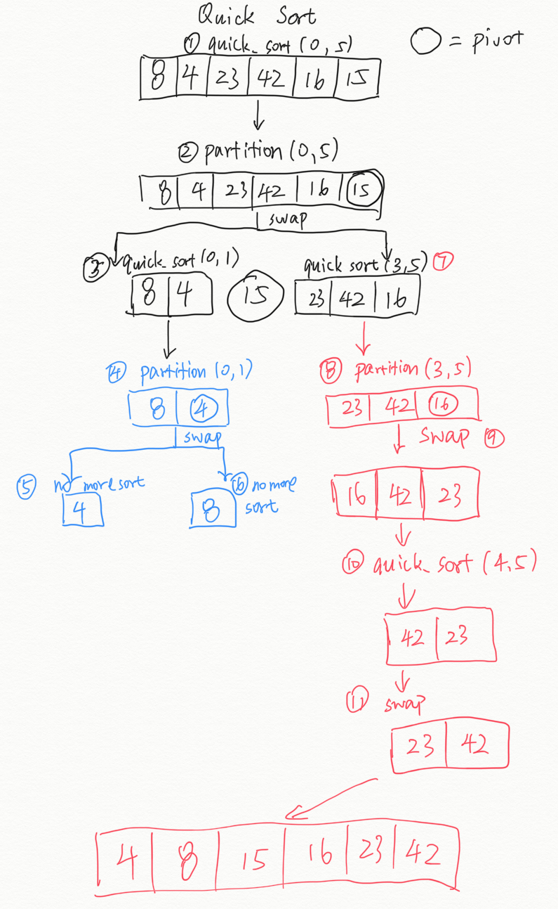

# Quick sort

Quick sort is a sorting algorithm that:

1. Based on divid-and-conquer approach.
2. Choose the last element as pivot element and partitioning the array around it.
3. Left side of pivot contains all the elements that are elss than the pivot element, right side of pivot contains all the elements greater than the pivot.

## Pseudo Code

```Pseudo
ALGORITHM QuickSort(arr, left, right)
    if left < right
        // Partition the array by setting the position of the pivot value
        DEFINE position <-- Partition(arr, left, right)
        // Sort the left
        QuickSort(arr, left, position - 1)
        // Sort the right
        QuickSort(arr, position + 1, right)

ALGORITHM Partition(arr, left, right)
    // set a pivot value as a point of reference
    DEFINE pivot <-- arr[right]
    // create a variable to track the largest index of numbers lower than the defined pivot
    DEFINE low <-- left - 1
    for i <- left to right do
        if arr[i] <= pivot
            low++
            Swap(arr, i, low)

     // place the value of the pivot location in the middle.
     // all numbers smaller than the pivot are on the left, larger on the right.
     Swap(arr, right, low + 1)
    // return the pivot index point
     return low + 1

ALGORITHM Swap(arr, i, low)
    DEFINE temp;
    temp <-- arr[i]
    arr[i] <-- arr[low]
    arr[low] <-- temp
```

## Trace

In our case, the sample array is ```[8,4,23,42,16,15]```
starting range:

left: Leftmost position of the array

right: Rightmost position of the array



## Efficency

### Time: O(n^2)

The basic operation of this algorithm is recursion. In the worst case, it will happen n^2 times

### Space: O(lon n)

- In-place partitioning is used. This unstable partition requires O(1) space.
- After partitioning, the partition with the fewest elements is (recursively) sorted first, requiring at most O(log n) space.
