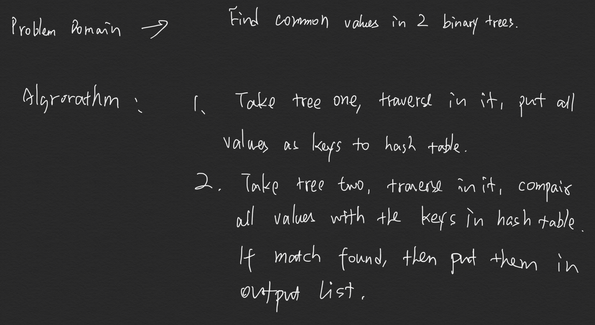

# Code Challenge

Find common values in 2 binary trees.

[Click here to see the code](./treeIntersection.js)

[Click here to see the tester](./treeIntersection.test.js)

## Feature Tasks

- Write a function called ```tree_intersection``` that takes two binary tree parameters.
- Without utilizing any of the built-in library methods available to your language, return a set of values found in both trees.

## Structure and Testing

Utilize the Single-responsibility principle: any methods you write should be clean, reusable, abstract component parts to the whole challenge. You will be given feedback and marked down if you attempt to define a large, complex algorithm in one function definition.

Write at least three test assertions for each method that you define.

Ensure your tests are passing before you submit your solution.

## Example

Input:


OUPUT : [100,160,125,175,200,350,500]

## Approach & Efficiency

1. take tree 1, traverse inside of it using pre-order method, put every value as a key with value 1 in a hash table.

2. take tree 2, traverse inside of it, compair every value with the keys inside previous hash table. if a match is found, then put it to the output array.

3. return the ouput array when the function is call with two binary trees as args.

Big O is O(2n), equals to O(n). It takes n times to build up the hash table, then take another n time to find all the match.

## solution

