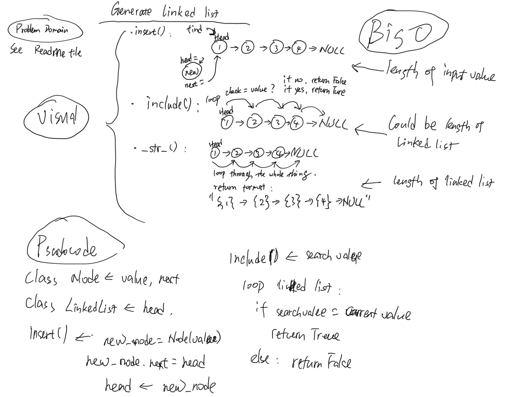
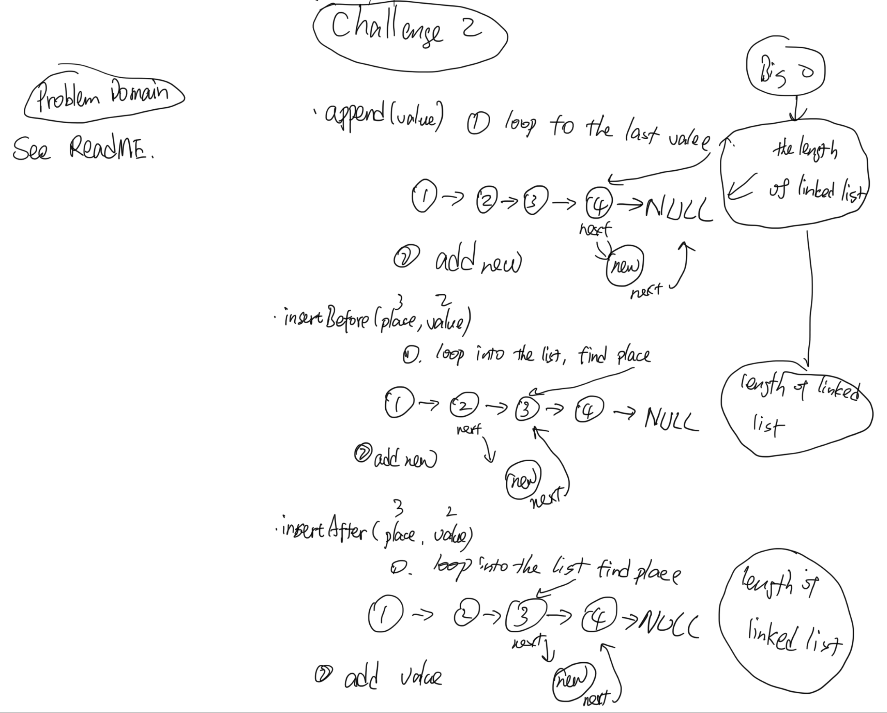
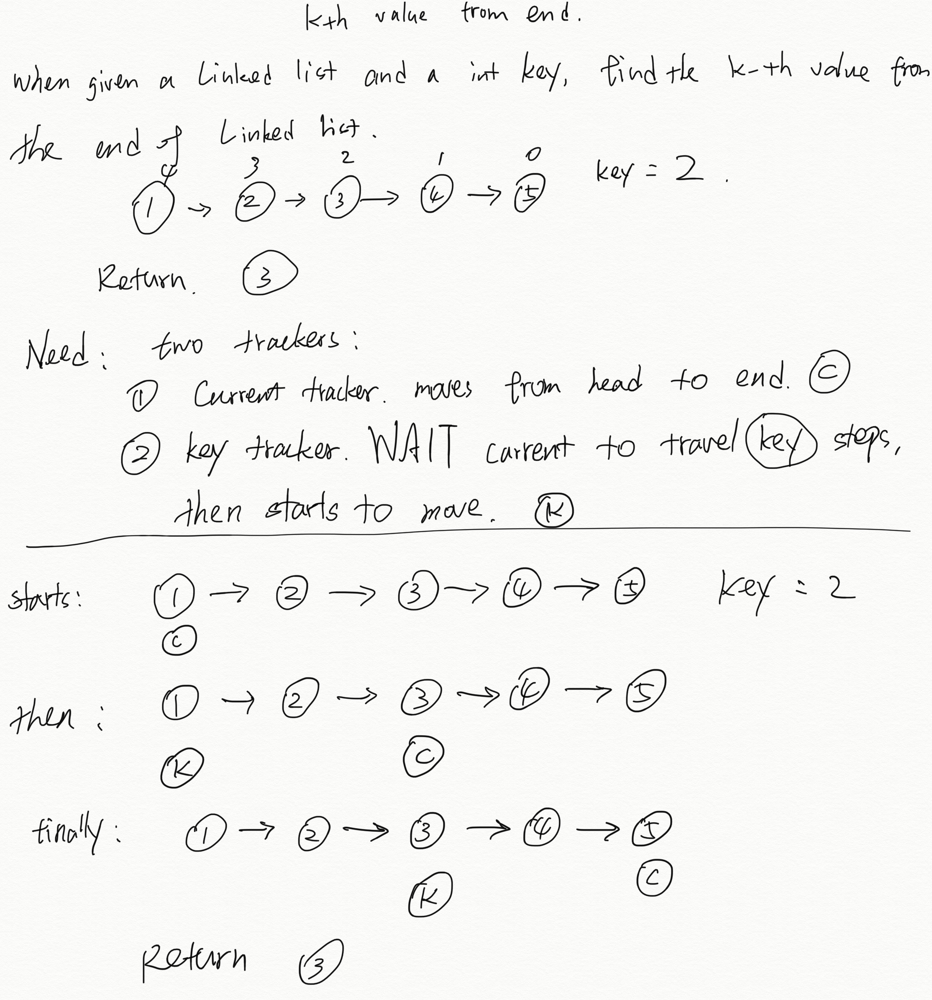

# Implementation: Singly Linked Lists

[Click here to see the code](linked-list.js)

[Click here to see the tester](linked-list.test.js)

## 1st assignment

### Features

- Create a Node class that has properties for the value stored in the Node, and a pointer to the next Node.
- Within your LinkedList class, include a head property. Upon instantiation, an empty Linked List should be created.
  - Define a method called insert which takes any value as an argument and adds a new node with that value to the head of the list with an `O(1)` Time performance.
  - Define a method called includes which takes any value as an argument and returns a boolean result depending on whether that value exists as a Node’s value somewhere within the list.
  - Define a method called toString `(or __str__ in Python)` which takes in no arguments and returns a string representing all the values in the Linked List, formatted as:
    - `"{ a } -> { b } -> { c } -> NULL"`
- Any exceptions or errors that come from your code should be semantic, capturable errors. For example, rather than a default error thrown by your language, your code should raise/throw a custom, semantic error that describes what went wrong in calling the methods you wrote for this lab.
- Be sure to follow your language/frameworks standard naming conventions `(e.g. C# uses PascalCasing for all method and class names)`.

### Structure and Testing

Utilize the Single-responsibility principle: any methods you write should be clean, reusable, abstract component parts to the whole challenge. You will be given feedback and marked down if you attempt to define a large, complex algorithm in one function definition.

Write tests to prove the following functionality:

1. Can successfully instantiate an empty linked list
2. Can properly insert into the linked list
3. The head property will properly point to the first node in the linked list
4. Can properly insert multiple nodes into the linked list
5. Will return true when finding a value within the linked list that exists
6. Will return false when searching for a value in the linked list that does not exist
7. Can properly return a collection of all the values that exist in the linked list

Ensure your tests are passing before you submit your solution.

### Stretch Goal

Create a new branch called doubly-linked-list, and, using the resources available to you online, implement a doubly linked list `(completely separate from your singly linked list)`.

### API
<!-- Description of each method publicly available to your Linked List -->
1. **.insert()** method will take a list of values, insert them before the head of the linked list. Use a for loop to check the length of value to be inserted, link them together, then reset the linked list head to the new head value, link the last inserted value's next value to the previous head of the list.
2. **.includes()** method use while loop to check every single value of the linked list, if it find a match, then return True, otherwise, Faluse.
3. **__str__()** method use the while loop too, find every value in the linked list, convert to string, format to { value } and added "->" between values and then output the whole values as one signle string.

### Solutions:


---------

## 2nd Assignment

### Features

Write the following methods for the Linked List class:

- `.append(value)` which adds a new node with the given value to the end of the list
- `.insertBefore(value, newVal)` which add a new node with the given newValue immediately before the first value node
- `.insertAfter(value, newVal)` which add a new node with the given newValue immediately after the first value node

Examples

**`.append(value)`**

|Input|Args|Output|
|---|---|---|
|`head -> [1] -> [3] -> [2] -> X`|5|`head -> [1] -> [3] -> [2] -> [5] -> X`|
|`head -> X`|1|`head -> [1] -> X`|

**`.insertBefore(value, newVal)`**

|Input|Args|Output|
|---|---|---|
|`head -> [1] -> [3] -> [2] -> X`|3, 5|`head -> [1] -> [5] -> [3] -> [2] -> X`|
|`head -> [1] -> [3] -> [2] -> X`|1, 5|`head -> [5] -> [1] -> [3] -> [2] -> X`|
|`head -> [1] -> [2] -> [2] -> X`|2, 5|`head -> [1] -> [5] -> [2] -> [2] -> X`|
|`head -> [1] -> [3] -> [2] -> X`|4, 5|Exception|

**`.insertAfter(value, newVal)`**

|Input|Args|Output|
|---|---|---|
|`head -> [1] -> [3] -> [2] -> X`|3, 5|`head -> [1] -> [3] -> [5] -> [2] -> X`|
|`head -> [1] -> [3] -> [2] -> X`|2, 5|`head -> [1] -> [3] -> [2] -> [5] -> X`|
|`head -> [1] -> [2] -> [2] -> X`|2, 5|`head -> [1] -> [2] -> [5] -> [2] -> X`|
|`head -> [1] -> [3] -> [2] -> X`|4, 5|Exception

### Unit Tests

Utilize the Single-responsibility principle: any methods you write should be clean, reusable, abstract component parts to the whole challenge. You will be given feedback and marked down if you attempt to define a large, complex algorithm in one function definition.

You have access to the Node class and all the properties on the Linked List class.

Write tests to prove the following functionality:

1. Can successfully add a node to the end of the linked list
2. Can successfully add multiple nodes to the end of a linked list
3. Can successfully insert a node before a node located i the middle of a linked list
4. Can successfully insert a node before the first node of a linked list
5. Can successfully insert after a node in the middle of the linked list
6. Can successfully insert a node after the last node of the linked list

Unit tests must be passing before you submit your final solution code.

### Stretch Goal

Once you’ve achieved a working solution, write an additional method to delete a node with the given value from the linked list.

### API

1. the **.append()** method loops into the linked list, find the last value, then add it to the end.
2. the **.insertBefore()** method loops into the linked list, find the target value, then add new value before it.
3. the **.insertAfter()** method loops into the linked list, find the target value, then add new value after it.

### Solutions:



-------

## 3rd assignment

k-th value from the end of a linked list.

### Features

- Write a method ```.reverseSearch``` for the Linked List class which takes a number, k, as a parameter. Return the node’s value that is k from the end of the linked list. You have access to the Node class and all the properties on the Linked List class as well as the methods created in previous challenges.

Example
```ll.kthFromEnd(k)```

|Input ll|Arg k|Output|
|---|---|---|
|`head -> [1] -> [3] -> [8] -> [2] -> X`|0|2|
|`head -> [1] -> [3] -> [8] -> [2] -> X`|2|3|
|`head -> [1] -> [3] -> [8] -> [2] -> X`|6|Exception|

### Unit test

1. Where k is greater than the length of the linked list
2. Where k and the length of the list are the same
3. Where k is not a positive integer
4. Where the linked list is of a size 1
5. “Happy Path” where k is not at the end, but somewhere in the middle of the linked list

### API

1. the **.reverseSearch(key)** method used two trackers to track the node:
   1. a current tracker, starts with head, moves forward until the end.
   2. a keyFinder tracker, wait current trackers to move ahead key steps, then start to move.
   3. When current tracker reaches the end, the keyFInder tracker is at the Node we're looking for.
   4. Big O of time is `O(n)`

2. The **.findMid()** method used two trackers too:
   1. a current tracker, starts with head, moves forward until the end.
   2. a mid tracker, moves one step when current tracker moves two steps.
   3. when current tracker reaches the end, the mid tracker is at the node we're looking for.
   4. Big O of time is `O(n)`

### Solutions:

