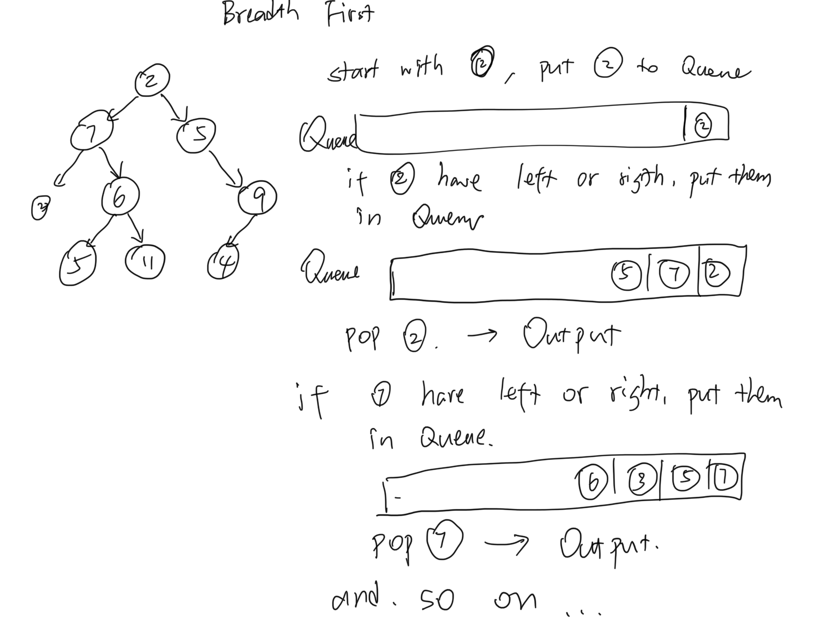
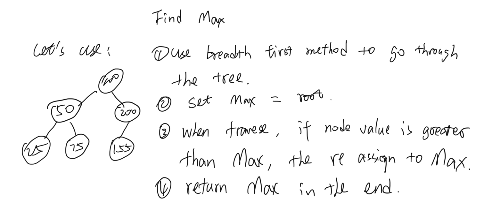

# Implementation: Trees

[click here to see the code](./tree.js)

[click here to see the tester code](./tree.test.js)

## Features

- Create a Node class that has properties for the value stored in the node, the left child node, and the right child node.
- Create a BinaryTree class
  - Define a method for each of the depth first traversals called **preOrder**, **inOrder**, and **postOrder** which returns an array of the values, ordered appropriately.
- Any exceptions or errors that come from your code should be semantic, capturable errors. For example, rather than a default error thrown by your language, your code should raise/throw a custom, semantic error that describes what went wrong in calling the methods you wrote for this lab.
- Write a breadth first traversal method which takes a Binary Tree as its unique input. Without utilizing any of the built-in methods available to your language, traverse the input tree using a Breadth-first approach, and return a list of the values in the tree in the order they were encountered.
- Write an instance method called ```find-maximum-value```. Without utilizing any of the built-in methods available to your language, return the maximum value stored in the tree. You can assume that the values stored in the Binary Tree will be numeric.

- Create a BinarySearchTree class
  - Define a method named **add** that accepts a value, and adds a new node with that value in the correct location in the binary search tree.
  - Define a method named **contains** that accepts a value, and returns a boolean indicating whether or not the value is in the tree at least once.

## Structure and Testing

Utilize the Single-responsibility principle: any methods you write should be clean, reusable, abstract component parts to the whole challenge. You will be given feedback and marked down if you attempt to define a large, complex algorithm in one function definition.

Write tests to prove the following functionality:

1. Can successfully instantiate an empty tree
2. Can successfully instantiate a tree with a single root node
3. Can successfully add a left child and right child to a single root node
4. Can successfully return a collection from a preorder traversal
5. Can successfully return a collection from an inorder traversal
6. Can successfully return a collection from a postorder traversal
7. Can successfully return a collection from a breadth first traversal
8. Can successfully return the max value

## solution


- Pre-order:  ```100, 50, 25, 75, 200, 155```
- In-order: ```25, 50, 75, 100, 155, 200```
- Post-order: ```25, 75, 50, 155, 200, 100```

<!-- 

- Breadth first: ```[2,7,5,2,6,9,5,11,4]```
 -->

### max value



## Big O

### Binary Tree traverse

For O time, all  methods requre O(n) to traverse.

For O space, all methods require O(n) cause we're building up call stacks.

### Binary Search Tree add and contains

- for O time:
  - both add() and contains() take log(n) (the height) of the tree to finish it.

- for O space:
  - add() using while loop, only taking addtional 1 space
  - contains() using recursion, takes O(n) space to build up call stacks.

### find max value

- for O time:
  - it takes O(n) to compaire every value inside of the tree and find the max

- for O space:
  - it take O(1) extra space.
